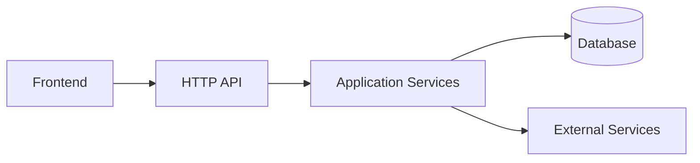

# Project Blueprint Skill

A portable Codex / Agent Skill that reverse-engineers an existing software repository into an evidence-backed architecture blueprint and a reconstruction guide.

It is designed for one core goal:

> Let a developer or coding agent understand an unfamiliar project quickly — and rebuild a runnable, testable, behaviorally equivalent implementation from an empty directory using the generated documentation.

## What it does

`project-blueprint` analyzes a repository deeply instead of just summarizing folders.

It can:

- inspect the full relevant codebase;
- identify entrypoints, runtime units, modules, dependencies, data stores, APIs, jobs, queues, integrations, and deployment paths;
- trace critical end-to-end runtime flows;
- explain **why the project appears to be structured this way**;
- inspect Git history for architecture evolution and design intent;
- distinguish facts from inference;
- generate Mermaid architecture, dependency, sequence, data, and deployment diagrams;
- run safe build / test / typecheck / lint validation where feasible;
- generate both human-readable Markdown and machine-readable YAML;
- produce a phased reconstruction plan starting from an empty directory;
- refresh an existing blueprint incrementally in update mode;
- avoid modifying application source code or Git state;
- redact secrets automatically.

## Core principle

The skill must explain the project — not merely describe its files.

Low-value documentation:

```text
src/services contains services.
src/components contains UI components.
```

Expected documentation:

```text
Authentication is split across three boundaries:

HTTP layer
    ↓
Auth middleware
    ↓
Session service
    ↓
Persistence adapter

The separation appears intended to keep transport-specific logic outside
session lifecycle behavior.

Status: strongly_inferred

Evidence:
- src/http/middleware/auth.ts
- src/domain/session.ts
- src/db/sessionRepository.ts
- tests/session.test.ts
```

## Evidence model

Architectural and design conclusions use four evidence levels:

| Status | Meaning |
|---|---|
| `confirmed` | Explicitly supported by source, config, docs, tests, or Git history |
| `strongly_inferred` | Multiple repository signals strongly support the conclusion |
| `possible` | Plausible, but evidence is limited |
| `unknown` | Insufficient or conflicting evidence |

A plausible explanation is never presented as historical fact.

## Output

By default, the skill generates:

```text
project-blueprint/
├── BLUEPRINT.md
├── blueprint.yaml
│
├── architecture/
│   ├── system.md
│   ├── modules.md
│   ├── dependencies.md
│   └── diagrams.md
│
├── implementation/
│   ├── directory-map.md
│   ├── modules.md
│   ├── runtime-flows.md
│   ├── data-model.md
│   └── api-contracts.md
│
├── operations/
│   ├── environment.md
│   ├── build.md
│   ├── testing.md
│   └── deployment.md
│
├── rationale/
│   ├── design-decisions.md
│   └── project-evolution.md
│
├── reconstruction/
│   ├── README.md
│   ├── phase-01-bootstrap.md
│   ├── phase-02-foundation.md
│   ├── phase-03-core.md
│   ├── phase-04-integrations.md
│   ├── phase-05-client.md
│   ├── phase-06-tests.md
│   └── validation.md
│
└── audit/
    ├── evidence-index.md
    ├── known-unknowns.md
    └── analysis-report.md
```

## Machine-readable blueprint

In addition to Markdown, the skill generates `blueprint.yaml`.

Typical structure:

```yaml
schema_version: "1.0"

project:
  name:
  summary:
  repository_type:
  languages: []
  frameworks: []

runtime_units: []
entrypoints: []
modules: []
runtime_flows: []

data:
  stores: []
  entities: []

contracts:
  apis: []
  events: []
  public_interfaces: []

external_services: []

build:
  commands: []

test:
  commands: []

reconstruction:
  phases: []

unknowns: []
validation: []
```

This makes the output easier for other coding agents to consume without re-reading the entire source repository.

## Architecture diagrams

The skill attempts to generate Mermaid diagrams for all applicable parts of the project:

- system architecture;
- module dependency graph;
- request / runtime flow;
- sequence diagrams;
- entity relationships;
- state transitions;
- build and deployment flow.

Example:



## Reconstruction mode

The reconstruction documentation is not a normal tutorial.

It is intended to provide enough information for another developer or coding agent to rebuild the system from an empty directory.

Each reconstruction phase describes:

- goal;
- prerequisites;
- modules/files to create;
- contracts;
- expected behavior;
- dependencies;
- tests;
- evidence from the original repository;
- completion criteria.

The target is **behavioral and architectural equivalence**, not byte-for-byte source reproduction.

## Full analysis mode

Use this when no blueprint exists or when taking over an unfamiliar repository.

Example prompt:

```text
Use the project-blueprint skill to perform a full analysis of this repository.

Generate the complete blueprint under project-blueprint/.

Requirements:
- read all relevant source required to understand the real system;
- do not modify application source code or Git state;
- inspect Git history where useful;
- run safe build/test/typecheck validation where feasible;
- explain architectural rationale using evidence and confidence levels;
- generate Mermaid diagrams;
- make reconstruction documentation sufficient to rebuild the project
  from an empty directory into a runnable and testable equivalent system.
```

## Update mode

Existing blueprints can be refreshed without blindly rewriting everything.

Example:

```text
Use project-blueprint in update mode.

Compare the current repository with the existing project-blueprint/.

Identify changed modules and affected runtime flows first.
Update only affected documentation after reading enough surrounding code
to validate the architecture.

Refresh:
- diagrams;
- evidence;
- rationale;
- unknowns;
- validation results;
- reconstruction steps;
- blueprint.yaml.

Do not modify application source code or Git state.
```

## Repository inventory helper

The skill includes:

```text
scripts/repository_inventory.py
```

It is a read-only helper that reports:

- repository structure;
- language distribution;
- manifests and lockfiles;
- documentation entrypoints;
- Git branch / revision / working-tree status;
- potential secret-bearing file paths.

It intentionally does **not** read secret values.

Usage:

```bash
python3 scripts/repository_inventory.py /path/to/repository
```

## Safety model

The skill treats application source code and Git state as read-only.

It must not:

- edit application source;
- stage or commit;
- checkout/reset/clean/rebase;
- rewrite lockfiles;
- update dependencies;
- run fix-mode formatters or linters;
- deploy;
- execute database migrations against real systems;
- expose credentials or `.env` values.

The only default project writes are generated documents under:

```text
project-blueprint/
```

## Skill structure

```text
project-blueprint/
├── SKILL.md
├── README.md
├── USAGE.md
├── references/
│   ├── analysis-protocol.md
│   ├── architecture-reasoning.md
│   ├── blueprint-spec.md
│   ├── evidence-standard.md
│   ├── reconstruction-spec.md
│   └── security-rules.md
├── scripts/
│   └── repository_inventory.py
└── templates/
    ├── BLUEPRINT.md
    ├── analysis-report.md
    ├── blueprint.yaml
    ├── detail-document.md
    └── reconstruction-phase.md
```

## Installation

Install or import the `project-blueprint` directory using the Skill mechanism supported by your Codex / Agent environment.

The main entrypoint is:

```text
SKILL.md
```

Keep the supporting `references/`, `templates/`, and `scripts/` directories together with it.

## Recommended use cases

This skill is especially useful for:

- taking over a legacy or unfamiliar codebase;
- developer onboarding;
- project handoff;
- architecture review;
- codebase migration;
- technical due diligence;
- agent-to-agent project transfer;
- documentation recovery;
- disaster recovery planning;
- preparing a repository for major refactoring;
- understanding why architectural boundaries exist;
- reconstructing systems whose original context has been lost.

## Philosophy

A useful project blueprint should answer:

1. What does this system do?
2. Where does execution begin?
3. What are the major runtime components?
4. How do components depend on each other?
5. Where does business logic live?
6. How does data move through the system?
7. What state is persisted?
8. Which external systems are required?
9. How is it built, tested, and deployed?
10. Why is it structured this way?
11. Which conclusions are certain and which are inferred?
12. What remains unknown?
13. How can the project be rebuilt from scratch?
14. How can the reconstructed project be verified?

If the generated documentation cannot answer those questions, the blueprint is not finished.

---

## 中文说明

`project-blueprint` 是一个面向 Codex / Coding Agent 的项目逆向理解 Skill。

它的目标不是简单生成 README，而是让 AI 深度阅读一个陌生项目，理解：

- 项目整体架构；
- 模块职责与依赖；
- 关键运行流程；
- 数据模型与 API；
- 构建、测试和部署方式；
- 项目为什么可能采用当前设计；
- Git 历史中的架构演进；
- 哪些结论是确定事实、哪些只是有证据的推断。

最终生成一套 `project-blueprint/` 文档，使另一个开发者或 Coding Agent 即使从空目录开始，也能按照文档逐步重建一个可运行、可测试、行为和架构基本等价的项目。
