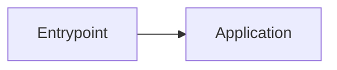

# Project Blueprint — <project>

> Generated from repository evidence. See `audit/evidence-index.md` and `audit/known-unknowns.md`.

## 1. Project identity

- **Purpose:**
- **Repository type:**
- **Primary languages:**
- **Primary frameworks:**
- **Runtime units:**

## 2. System at a glance

Explain the system in 5–12 sentences, including its users, core responsibility, runtime boundaries, persistence, and external systems.

## 3. Architecture



### Architectural style

### Major boundaries

## 4. Module map

| Module | Path | Responsibility | Depends on | Evidence |
|---|---|---|---|---|

## 5. Critical runtime flows

- [Flow](implementation/runtime-flows.md)

## 6. Data and state

## 7. External integrations

## 8. Run / build / test

```bash
# exact repository-defined commands
```

## 9. Why it is built this way

Summarize only evidence-backed rationale and confidence.

## 10. Reconstruction readiness

- **Overall confidence:**
- **Known blockers:**
- **Start here:** `reconstruction/README.md`

## 11. Detailed documents

- `architecture/`
- `implementation/`
- `operations/`
- `rationale/`
- `reconstruction/`
- `audit/`
